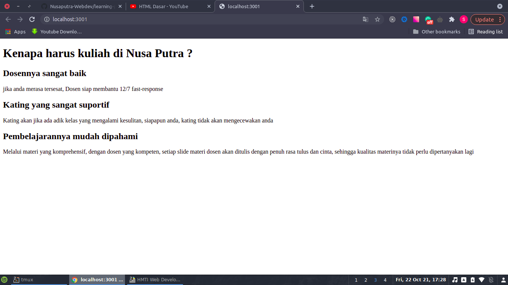

# Heading and Paragraph

## Prerequisite / Materi yang harus dipelajari (Silahkan klik)

1. [Pendahuluan HTML](https://www.youtube.com/watch?v=NBZ9Ro6UKV8&list=PLFIM0718LjIVuONHysfOK0ZtiqUWvrx4F&index=1)
2. [Website Pertama](https://www.youtube.com/watch?v=1NicaVOCXHA&list=PLFIM0718LjIVuONHysfOK0ZtiqUWvrx4F&index=2)
3. [Code Editor](https://www.youtube.com/watch?v=3sLSi9L5nWE&list=PLFIM0718LjIVuONHysfOK0ZtiqUWvrx4F&index=3)
4. [Tag Dasar](https://www.youtube.com/watch?v=cUWBYzA6M-8&list=PLFIM0718LjIVuONHysfOK0ZtiqUWvrx4F&index=4)
5. [Paragraph](https://www.youtube.com/watch?v=Dl_bIYBc9gM&list=PLFIM0718LjIVuONHysfOK0ZtiqUWvrx4F&index=5)
6. [Heading](https://www.youtube.com/watch?v=SMetRBdIh-8&list=PLFIM0718LjIVuONHysfOK0ZtiqUWvrx4F&index=6)

**Note** jika sudah selesai, entar baraya tinggal kirim screenshot dari website baraya ke form yang ada di group

